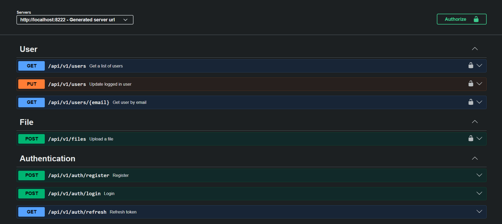

# 🌐 Spring Boot REST API Starter (PostgreSQL)

REST API starter template using **Spring Boot** + **PostgreSQL** with a **feature-based modular structure** (auth, user, file).

## Features

- **Spring Security + JWT**
  - Register, login, refresh token
  - Access token via `Authorization: Bearer <token>`
  - Refresh token stored in an **HttpOnly cookie** (`refresh_token`)
- **User profile setup**
  - Update `firstName`, `lastName`, optional `avatar` (uploaded file id)
  - User list endpoint returns only users with completed profiles
- **Flyway migrations** (`src/main/resources/db/migration`)
- **Docker Compose** for PostgreSQL (`docker-compose.yml`)
- **OpenAPI / Swagger UI**
  - Swagger UI: `http://localhost:8222/swagger-ui/index.html`
## Tech stack

- **Java**: 21
- **Spring Boot**: 4.x
- **Database**: PostgreSQL
- **Migrations**: Flyway
- **Auth**: Spring Security + JJWT
- **API docs**: springdoc-openapi

## Quick start (local)

### 1) Start PostgreSQL (Docker)

```bash
docker compose up -d
```

This starts Postgres on `localhost:5432` using the credentials in `docker-compose.yml` and `src/main/resources/application.yaml`.

### 2) Run the API (Maven)

```bash
./mvnw spring-boot:run
```

API runs on `http://localhost:8222`.

### 3) Open Swagger UI

- `http://localhost:8222/swagger-ui/index.html`



## Configuration

Main config lives in `src/main/resources/application.yaml`:

- **DB**: `spring.datasource.*`
- **Flyway**: `spring.flyway.*`
- **Uploads**:
  - `application.storage.type`: `local`
  - `application.storage.upload-dir`: `./uploads`
  - Static serving: `GET /uploads/**` (mapped to the local uploads folder)
- **JWT secret**: `application.security.secret`

## Auth flow (JWT)

- **Login** returns:
  - JSON body with **access token**
  - `Set-Cookie: refresh_token=...; HttpOnly; Path=/; ...`
- Use the **access token** for protected endpoints:
  - `Authorization: Bearer <accessToken>`
- **Refresh** endpoint reads the refresh token from the `refresh_token` cookie and returns a new access token + refreshed cookie.

### Note about refresh cookie in local HTTP

`AuthController` sets refresh cookie with `.secure(true)`. Browsers will typically **not store Secure cookies on plain HTTP**.

- For local testing with a browser, either:
  - run behind HTTPS, or
  - change cookie `.secure(false)` for local only
- If you use a tool like curl/Postman and manually carry cookies, behavior may differ.

## API endpoints (current)

Base URL: `http://localhost:8222`

### Authentication (`/api/v1/auth`)

- **POST** `/api/v1/auth/register`
  - Body: `{ "email": "...", "password": "..." }`
  - Response: `201`
- **POST** `/api/v1/auth/login`
  - Body: `{ "email": "...", "password": "..." }`
  - Response: `200` + refresh cookie + body:
    - `email`, `accessToken`, `isCompletedProfile`
- **GET** `/api/v1/auth/refresh`
  - Reads refresh token from cookie `refresh_token`
  - Response: `200` + new refresh cookie + new access token

### Users (`/api/v1/users`) (JWT required)

- **PUT** `/api/v1/users`
  - Body: `{ "firstName": "...", "lastName": "...", "profileImageId": "optional-file-id" }`
  - Marks user profile as completed
  - If `profileImageId` is provided, the file is moved from `TEMP` to `USER_AVATAR`
- **GET** `/api/v1/users/{email}`
  - Returns user details by email
- **GET** `/api/v1/users?page=1&size=5`
  - Returns paginated list of users with completed profiles only

### Files (`/api/v1/files`) (JWT required)

- **POST** `/api/v1/files` (multipart/form-data)
  - Field: `file`
  - Validations:
    - Max size: **5MB**
    - Allowed types: `image/png`, `image/jpeg`, `image/webp`
  - Response: `201` with:
    - `fileId`, `url` (public URL under `/uploads/...`)

## Folder / module structure (feature-based)

```text
src/main/java/com/naarith/starter
├─ config/              # Cross-cutting configuration (OpenAPI, scheduling, logging filter)
├─ entity/              # Shared base entity
├─ exception/           # Shared exception + error response model
├─ features/
│  ├─ auth/             # Auth (JWT) feature module
│  ├─ user/             # User/profile feature module
│  └─ file/             # File upload/storage feature module
└─ utils/               # Small shared utilities
```

## Database migrations (Flyway)

Migrations are in `src/main/resources/db/migration` and run automatically at startup:

- `V1__init.sql`: enables useful PostgreSQL extensions (`pg_trgm`, `unaccent`)
- `V2__create_users_table.sql`: creates `users` table + trigram indexes for search
- `V3__create_files_table.sql`: creates `files` table + FK `files.uploaded_by -> users.uid`
- `V4__add_foreign_key_for_users.sql`: FK `users.profile_image_id -> files.id`

## File-by-file descriptions (short)

### App entrypoint

- `src/main/java/com/naarith/starter/SpringBootStarterApplication.java`: Spring Boot application bootstrap class.

### `config/`

- `config/OpenApiConfig.java`: configures OpenAPI metadata + Bearer JWT scheme, and injects a shared `ApiError` schema into 4xx/5xx responses (also adds 401/403 to secured operations).
- `config/RequestLoggingFilter.java`: logs method, path, status, and request duration for each request.
- `config/SchedulingConfig.java`: enables Spring scheduling (`@EnableScheduling`) used by background jobs like file cleanup.

### Shared error handling (`exception/`)

- `exception/ApiError.java`: standardized error payload model (used by exception handlers and security handlers).
- `exception/BaseException.java`: base runtime exception carrying an `HttpStatus`.
- `exception/GlobalExceptionHandler.java`: centralized exception handling for `BaseException` and validation errors (`MethodArgumentNotValidException`).
- `exception/ResourceNotFoundException.java`: `404` exception used across features when something can’t be found.

### Shared base entity (`entity/`)

- `entity/BaseEntity.java`: provides `createdAt`/`updatedAt` timestamps via JPA lifecycle hooks.

### `features/auth/` (JWT auth)

- `features/auth/controller/AuthController.java`: register/login/refresh endpoints; sets refresh token in `HttpOnly` cookie.
- `features/auth/dto/RegisterReqDTO.java`: request payload for register (email + password validation).
- `features/auth/dto/LoginReqDTO.java`: request payload for login.
- `features/auth/dto/LoginResDTO.java`: login/refresh response payload (email, access token, profile completion flag).
- `features/auth/enums/TokenType.java`: differentiates access vs refresh tokens.
- `features/auth/exception/InvalidCredentialsExceptions.java`: thrown when login fails (bad credentials or user not found).
- `features/auth/exception/TokenExpiredException.java`: thrown when JWT is expired.
- `features/auth/exception/TokenInvalidException.java`: thrown when JWT is invalid (bad signature/type/user no longer exists).
- `features/auth/security/SecurityConfig.java`: Spring Security filter chain (public auth endpoints + Swagger + `/uploads/**`, everything else secured) with custom 401/403 JSON responses.
- `features/auth/security/JwtAuthenticationFilter.java`: extracts and validates Bearer access tokens and sets `SecurityContext`.
- `features/auth/security/CustomUserDetailsService.java`: loads user details from `UserService` for authentication.
- `features/auth/security/UserPrincipal.java`: `UserDetails` implementation wrapping `UserDTO` (grants `USER` authority).
- `features/auth/service/AuthService.java`: register/login/refresh business logic (password encoding + token generation).
- `features/auth/service/JwtService.java`: generates and validates JWTs (access: 10 min, refresh: 60 min) and enforces `tokenType` claim.
- `features/auth/service/model/LoginResult.java`: internal service return type combining `LoginResDTO` + refresh token string.

### `features/user/` (users & profile)

- `features/user/controller/UserController.java`: endpoints for updating current user, fetching user details by email, and listing users with completed profiles.
- `features/user/dto/UserDTO.java`: internal DTO representing a user (used for auth principal and persistence mapping).
- `features/user/dto/UserUpdateReqDTO.java`: request payload for profile update (first/last name + optional profile image id).
- `features/user/dto/UserDetailsResDTO.java`: user details response DTO (includes profile image URL when available).
- `features/user/dto/UserListReqDTO.java`: pagination request for listing users (defaults to page=1, size=5).
- `features/user/dto/UserListResDTO.java`: paginated user list response.
- `features/user/entity/User.java`: JPA user entity (NanoId id, email, password hash, names, completed flag, optional profile image relation).
- `features/user/repository/UserRepository.java`: JPA repository with `EntityGraph` to fetch profile image when loading users.
- `features/user/service/UserService.java`: user CRUD + profile completion logic; integrates with `FileService` to move avatar out of TEMP and delete old avatar.
- `features/user/mapper/UserMapper.java`: maps between entity and DTO/response; builds public upload URLs via `Utils`.
- `features/user/exception/EmailAlreadyExistsException.java`: thrown when registering with an existing email.
- `features/user/exception/UserNotFoundException.java`: thrown when user lookup fails.
- `features/user/exception/InvalidProfileImageException.java`: thrown when provided profile image id is missing or not usable.

### `features/file/` (uploads & storage)

- `features/file/controller/FileController.java`: file upload endpoint (multipart); currently focuses on upload.
- `features/file/dto/FileUploadResDTO.java`: upload response (file id + public URL).
- `features/file/entity/File.java`: JPA file entity (NanoId id, storage path, mime/type/size, usage type, uploaded by user).
- `features/file/enums/UsageType.java`: file usage classification (`TEMP`, `USER_AVATAR`) used for folder placement and lifecycle.
- `features/file/repository/FileRepository.java`: file repository plus queries for cleanup (unused TEMP files older than cutoff) and path lookup.
- `features/file/mapper/FileMapper.java`: maps file entity to response and builds public URL via `Utils`.
- `features/file/config/FileProperties.java`: binds `application.storage.*` configuration properties (e.g., upload dir).
- `features/file/config/FileWebMvcConfig.java`: maps `/uploads/**` to the local filesystem upload directory for static serving.
- `features/file/service/StorageService.java`: storage abstraction (store/load/delete/move/exists).
- `features/file/service/LocalStorageService.java`: local filesystem storage implementation (tmp + per-usage folders).
- `features/file/service/FileValidator.java`: validates uploaded images (size/type/non-empty).
- `features/file/service/FileService.java`: orchestrates upload, DB persistence, and moving/deleting files.
- `features/file/service/FileCleanupJob.java`: scheduled job deleting TEMP files older than 24 hours (runs hourly).
- `features/file/service/model/StoredFile.java`: internal model representing stored file metadata after saving.
- `features/file/exception/InvalidFileException.java`: thrown when upload validation fails.
- `features/file/exception/StorageException.java`: thrown on storage-layer failures (store/load/move).

### `utils/`

- `utils/Utils.java`: helper for building absolute URLs (used to expose upload URLs in API responses).
